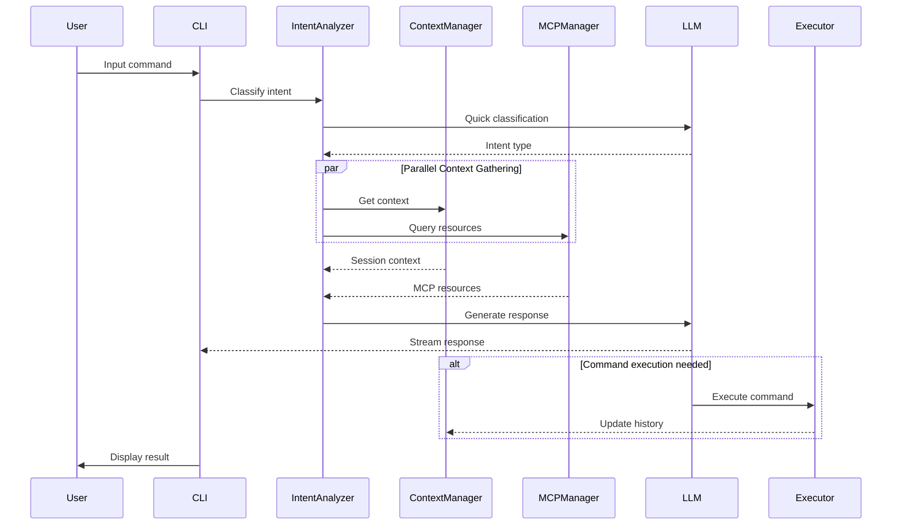
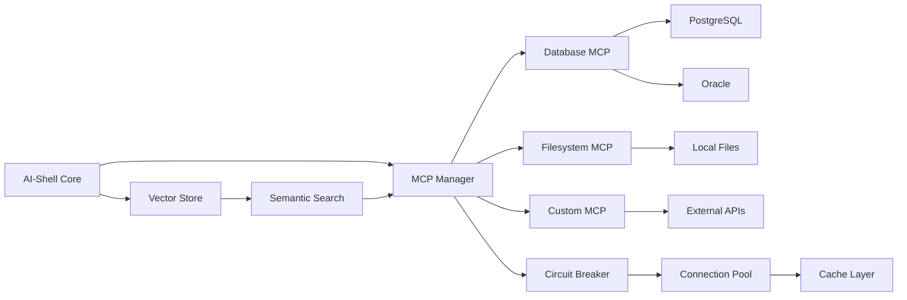

# AI-Shell System Architecture Design v2.0

## Executive Summary

**Architect:** Hive Mind Architecture Agent
**Date:** 2025-10-26
**Version:** 2.0
**Status:** Complete

This document presents a comprehensive system architecture for AI-Shell that integrates:
- **MCP (Model Context Protocol) clients** for plugin-based extensibility
- **Local LLM integration** with async streaming inference
- **Asynchronous processing** for command execution and AI operations
- **Context-aware state management** with persistent memory
- **Modular component structure** for maintainability and scalability

---

## 1. Architecture Overview

### 1.1 System Layers (C4 Model - Context Level)

```
┌──────────────────────────────────────────────────────────────────┐
│                         AI-SHELL SYSTEM                          │
│                                                                  │
│  ┌────────────────────────────────────────────────────────────┐ │
│  │              USER INTERFACE LAYER (CLI)                    │ │
│  │  - Terminal UI (Textual/prompt-toolkit)                    │ │
│  │  - Command Parser & REPL                                   │ │
│  │  - Real-time Output Formatting                             │ │
│  └────────────────────────────────────────────────────────────┘ │
│                              ↓                                   │
│  ┌────────────────────────────────────────────────────────────┐ │
│  │           COMMAND PROCESSING LAYER                         │ │
│  │  - Intent Classifier                                       │ │
│  │  - Command Interpreter                                     │ │
│  │  - Async Command Executor                                  │ │
│  └────────────────────────────────────────────────────────────┘ │
│                              ↓                                   │
│  ┌────────────────────────────────────────────────────────────┐ │
│  │              AI INTEGRATION LAYER                          │ │
│  │  ┌──────────────┐  ┌──────────────┐  ┌─────────────────┐  │ │
│  │  │ MCP Client   │  │   LLM        │  │   Context       │  │ │
│  │  │ Manager      │  │   Provider   │  │   Manager       │  │ │
│  │  └──────────────┘  └──────────────┘  └─────────────────┘  │ │
│  └────────────────────────────────────────────────────────────┘ │
│                              ↓                                   │
│  ┌────────────────────────────────────────────────────────────┐ │
│  │           ASYNC PROCESSING LAYER                           │ │
│  │  - Event Bus                                               │ │
│  │  - Task Queue                                              │ │
│  │  - Stream Processing                                       │ │
│  └────────────────────────────────────────────────────────────┘ │
│                              ↓                                   │
│  ┌────────────────────────────────────────────────────────────┐ │
│  │             INFRASTRUCTURE LAYER                           │ │
│  │  - Memory Store (SQLite + Vector DB)                       │ │
│  │  - Configuration Manager                                   │ │
│  │  - Plugin System                                           │ │
│  └────────────────────────────────────────────────────────────┘ │
│                                                                  │
└──────────────────────────────────────────────────────────────────┘
        ↓                    ↓                    ↓
┌─────────────┐      ┌──────────────┐     ┌────────────────┐
│ MCP Servers │      │ Local LLM    │     │ System Shell   │
│ (Database,  │      │ (Ollama,     │     │ (bash, zsh,    │
│  Files)     │      │  LlamaCPP)   │     │  PowerShell)   │
└─────────────┘      └──────────────┘     └────────────────┘
```

### 1.2 Core Design Principles

1. **Async-First**: All I/O operations are non-blocking
2. **Plugin-Based**: MCP enables extensibility without core changes
3. **Context-Aware**: Persistent state and conversation memory
4. **Security-First**: Credential encryption, command validation, risk assessment
5. **Performance-Optimized**: Connection pooling, caching, streaming

---

## 2. Component Architecture (C4 Model - Container Level)

### 2.1 MCP Client Integration Layer

**Purpose:** Manage multiple MCP server connections with lifecycle management, error recovery, and resource pooling.

**Key Components:**

```python
# Component Diagram
┌────────────────────────────────────────────────────┐
│          MCP Client Manager                        │
│                                                    │
│  ┌──────────────────────────────────────────────┐ │
│  │  Connection Pool Manager                     │ │
│  │  - Multi-server coordination                 │ │
│  │  - Lifecycle: init → connect → operate       │ │
│  │  - Circuit breaker pattern                   │ │
│  └──────────────────────────────────────────────┘ │
│                     ↓                              │
│  ┌──────────────────────────────────────────────┐ │
│  │  MCP Transport Layer                         │ │
│  │  - stdio: Local process communication        │ │
│  │  - SSE/HTTP: Remote server communication     │ │
│  └──────────────────────────────────────────────┘ │
│                     ↓                              │
│  ┌──────────────────────────────────────────────┐ │
│  │  Protocol Handler (JSON-RPC 2.0)             │ │
│  │  - Request/Response mapping                  │ │
│  │  - Capability negotiation                    │ │
│  │  - Error handling & retry                    │ │
│  └──────────────────────────────────────────────┘ │
└────────────────────────────────────────────────────┘
           ↓                ↓                ↓
    ┌──────────┐    ┌──────────┐    ┌──────────┐
    │ Database │    │   File   │    │  Custom  │
    │   MCP    │    │  System  │    │   MCP    │
    │  Server  │    │   MCP    │    │  Servers │
    └──────────┘    └──────────┘    └──────────┘
```

**Interface Contract:**

```python
from typing import Protocol, Dict, Any, List, AsyncIterator
from dataclasses import dataclass

@dataclass
class MCPServerConfig:
    """MCP Server Configuration"""
    name: str
    command: str
    args: List[str]
    env: Dict[str, str] = None
    transport_type: str = "stdio"  # stdio or sse
    auto_start: bool = True
    connection_pool_size: int = 5
    timeout_ms: int = 30000

@dataclass
class MCPCapabilities:
    """Server Capabilities Discovered During Init"""
    resources: bool = False
    resource_subscribe: bool = False
    tools: bool = False
    prompts: bool = False
    logging: bool = False

class MCPClient(Protocol):
    """MCP Client Interface"""

    async def initialize(self, config: MCPServerConfig) -> MCPCapabilities:
        """
        Initialize MCP connection with handshake.
        Returns discovered server capabilities.
        """
        ...

    async def list_resources(self) -> List[MCPResource]:
        """List available resources from server"""
        ...

    async def read_resource(self, uri: str) -> ResourceContent:
        """Read specific resource content"""
        ...

    async def list_tools(self) -> List[MCPTool]:
        """List available tools from server"""
        ...

    async def call_tool(self, name: str, arguments: Dict[str, Any]) -> ToolResult:
        """Execute tool with arguments"""
        ...

    async def close(self) -> None:
        """Graceful shutdown with cleanup"""
        ...

class MCPClientManager:
    """Manages multiple MCP server connections"""

    def __init__(self):
        self.clients: Dict[str, MCPClient] = {}
        self.connection_pools: Dict[str, ConnectionPool] = {}
        self.circuit_breakers: Dict[str, CircuitBreaker] = {}

    async def initialize_from_config(self, config_path: str) -> None:
        """
        Load MCP servers from configuration file.
        Auto-start servers with error recovery.
        """
        config = await self._load_config(config_path)

        for server_name, server_config in config.items():
            # Create client with circuit breaker
            client = await self._create_client(server_config)
            self.clients[server_name] = client

            # Initialize connection pool
            pool = ConnectionPool(
                factory=lambda: self._create_client(server_config),
                max_size=server_config.connection_pool_size
            )
            self.connection_pools[server_name] = pool

    async def get_client(self, server_name: str) -> MCPClient:
        """Get client with connection pooling"""
        pool = self.connection_pools.get(server_name)
        if pool:
            return await pool.acquire()
        return self.clients.get(server_name)

    async def release_client(self, server_name: str, client: MCPClient) -> None:
        """Return client to pool"""
        pool = self.connection_pools.get(server_name)
        if pool:
            await pool.release(client)
```

**Connection Lifecycle:**

```
1. INITIALIZATION PHASE
   ┌─────────────────────┐
   │ Load Config         │
   └──────┬──────────────┘
          ↓
   ┌─────────────────────┐
   │ Create Transport    │  (stdio spawn or HTTP connect)
   └──────┬──────────────┘
          ↓
   ┌─────────────────────┐
   │ Send 'initialize'   │  (Protocol version, capabilities)
   └──────┬──────────────┘
          ↓
   ┌─────────────────────┐
   │ Receive Capabilities│  (Server features)
   └──────┬──────────────┘
          ↓
   ┌─────────────────────┐
   │ Send 'initialized'  │  (Handshake complete)
   └──────┬──────────────┘

2. OPERATIONAL PHASE
   ┌─────────────────────┐
   │ Handle Requests     │  (list_resources, call_tool)
   └──────┬──────────────┘
          ↓
   ┌─────────────────────┐
   │ Process Responses   │  (Parse JSON-RPC, handle errors)
   └──────┬──────────────┘
          ↓
   ┌─────────────────────┐
   │ Update State        │  (Cache, metrics, health)
   └─────────────────────┘

3. SHUTDOWN PHASE
   ┌─────────────────────┐
   │ Drain Connections   │  (Complete pending requests)
   └──────┬──────────────┘
          ↓
   ┌─────────────────────┐
   │ Close Transport     │  (stdin.end() for stdio)
   └──────┬──────────────┘
          ↓
   ┌─────────────────────┐
   │ Wait for Exit       │  (Timeout: 5s)
   └──────┬──────────────┘
          ↓
   ┌─────────────────────┐
   │ Force Kill (SIGTERM)│  (If hung)
   └─────────────────────┘
```

### 2.2 Local LLM Integration Layer

**Purpose:** Async inference with streaming, context management, and model orchestration.

**Key Components:**

```python
from typing import AsyncIterator, Optional
import asyncio

class LLMProvider(Protocol):
    """Abstract LLM Provider Interface"""

    async def generate(
        self,
        prompt: str,
        system_prompt: Optional[str] = None,
        temperature: float = 0.7,
        max_tokens: int = 2048
    ) -> str:
        """Generate completion (non-streaming)"""
        ...

    async def stream(
        self,
        prompt: str,
        system_prompt: Optional[str] = None,
        temperature: float = 0.7,
        max_tokens: int = 2048
    ) -> AsyncIterator[str]:
        """Generate completion (streaming)"""
        ...

    async def embed(self, text: str) -> List[float]:
        """Generate text embeddings for similarity search"""
        ...

class OllamaProvider:
    """Ollama Local LLM Provider"""

    def __init__(self, base_url: str = "http://localhost:11434"):
        self.base_url = base_url
        self.http_client = AsyncHTTPClient()

    async def generate(self, prompt: str, **kwargs) -> str:
        response = await self.http_client.post(
            f"{self.base_url}/api/generate",
            json={
                "model": kwargs.get("model", "llama2"),
                "prompt": prompt,
                "system": kwargs.get("system_prompt"),
                "options": {
                    "temperature": kwargs.get("temperature", 0.7),
                    "num_predict": kwargs.get("max_tokens", 2048)
                }
            }
        )
        return response["response"]

    async def stream(self, prompt: str, **kwargs) -> AsyncIterator[str]:
        async with self.http_client.stream_post(
            f"{self.base_url}/api/generate",
            json={
                "model": kwargs.get("model", "llama2"),
                "prompt": prompt,
                "stream": True
            }
        ) as stream:
            async for chunk in stream:
                if "response" in chunk:
                    yield chunk["response"]

class LLMManager:
    """Central LLM orchestration with multi-provider support"""

    def __init__(self):
        self.providers: Dict[str, LLMProvider] = {}
        self.default_provider: str = "ollama"
        self.model_registry: Dict[str, ModelConfig] = {}

    async def initialize(self):
        """Initialize all configured LLM providers"""
        # Ollama for general tasks
        self.providers["ollama"] = OllamaProvider()

        # Specialized models
        await self._register_models()

    async def intent_analysis(self, user_input: str, context: Dict) -> Intent:
        """
        Analyze user intent with lightweight model.
        Non-blocking, returns quickly for UI responsiveness.
        """
        provider = self.providers["ollama"]

        prompt = f"""
        Analyze user intent:
        Input: {user_input}
        Context: {context.get('last_command', 'none')}

        Classify as: COMMAND, QUERY, TASK, or CONTEXT_SWITCH
        Confidence: 0-1
        """

        result = await provider.generate(prompt, model="llama2:7b")

        return Intent(
            type=self._parse_intent_type(result),
            confidence=self._parse_confidence(result),
            entities=self._extract_entities(result)
        )

    async def stream_response(
        self,
        prompt: str,
        context: ContextBundle
    ) -> AsyncIterator[str]:
        """
        Stream LLM response for real-time UI updates.
        Uses context from MCP resources and memory.
        """
        provider = self.providers[self.default_provider]

        # Build enhanced prompt with context
        enhanced_prompt = self._build_context_prompt(prompt, context)

        async for chunk in provider.stream(enhanced_prompt):
            yield chunk
```

**LLM Communication Patterns:**

```
┌─────────────────────────────────────────────────────────┐
│              LLM Communication Patterns                 │
│                                                         │
│  Pattern 1: INTENT CLASSIFICATION (Fast, Non-Streaming)│
│  ┌────────────┐                                         │
│  │ User Input │                                         │
│  └─────┬──────┘                                         │
│        ↓                                                │
│  ┌────────────┐     100-200ms latency                  │
│  │ LLM (7B)   │────→ Intent: COMMAND                   │
│  └────────────┘                                         │
│                                                         │
│  Pattern 2: STREAMING COMPLETION (Real-time)           │
│  ┌────────────┐                                         │
│  │ User Query │                                         │
│  └─────┬──────┘                                         │
│        ↓                                                │
│  ┌────────────┐     First token: <2s                   │
│  │ LLM (13B)  │────→ Stream: "To list files..."        │
│  └────────────┘                                         │
│        ↓                                                │
│  ┌────────────┐                                         │
│  │ UI Update  │ Real-time display                      │
│  └────────────┘                                         │
│                                                         │
│  Pattern 3: EMBEDDING GENERATION (Batch)               │
│  ┌────────────┐                                         │
│  │ Text Batch │                                         │
│  └─────┬──────┘                                         │
│        ↓                                                │
│  ┌────────────┐     Parallel processing                │
│  │ Embedding  │────→ Vectors: [384 dims]               │
│  │ Model      │                                         │
│  └────────────┘                                         │
└─────────────────────────────────────────────────────────┘
```

### 2.3 Async Processing Layer

**Purpose:** Event-driven, non-blocking execution with backpressure handling.

**Key Components:**

```python
import asyncio
from asyncio import Queue, Event
from typing import Callable, Awaitable

class AsyncEventBus:
    """
    High-performance event bus for inter-component communication.
    Supports priority queuing and backpressure.
    """

    def __init__(self):
        self.subscribers: Dict[str, List[Callable]] = defaultdict(list)
        self.event_queue: Queue[Event] = Queue(maxsize=1000)
        self.processing = True
        self.metrics = EventBusMetrics()

    async def publish(
        self,
        event_type: str,
        data: Any,
        priority: int = 5,
        critical: bool = False
    ):
        """
        Publish event to subscribers.
        Critical events bypass queue and execute immediately.
        """
        event = Event(
            type=event_type,
            data=data,
            priority=priority,
            critical=critical,
            timestamp=datetime.now()
        )

        if critical:
            # Execute immediately for critical events
            await self._process_event(event)
        else:
            # Queue for async processing
            await self.event_queue.put(event)

    def subscribe(self, event_type: str, handler: Callable[[Any], Awaitable]):
        """Register event handler"""
        self.subscribers[event_type].append(handler)

    async def process_events(self):
        """
        Main event processing loop.
        Runs as background task during application lifetime.
        """
        while self.processing:
            try:
                event = await asyncio.wait_for(
                    self.event_queue.get(),
                    timeout=0.1
                )
                await self._process_event(event)
            except asyncio.TimeoutError:
                continue

    async def _process_event(self, event: Event):
        """Process single event with all subscribers"""
        handlers = self.subscribers.get(event.type, [])

        # Execute handlers in parallel
        tasks = [handler(event.data) for handler in handlers]
        results = await asyncio.gather(*tasks, return_exceptions=True)

        # Track failures
        for result in results:
            if isinstance(result, Exception):
                self.metrics.record_failure(event.type, result)

class AsyncTaskQueue:
    """
    Priority-based task queue with worker pool management.
    """

    def __init__(self, max_workers: int = 4):
        self.queue: asyncio.PriorityQueue = asyncio.PriorityQueue()
        self.workers: List[asyncio.Task] = []
        self.max_workers = max_workers
        self.running = True

    async def start(self):
        """Start worker pool"""
        for i in range(self.max_workers):
            worker = asyncio.create_task(self._worker(f"worker-{i}"))
            self.workers.append(worker)

    async def enqueue(
        self,
        task: Callable[[], Awaitable],
        priority: int = 5,
        timeout: Optional[int] = None
    ):
        """Add task to queue with priority (lower = higher priority)"""
        await self.queue.put((priority, task, timeout))

    async def _worker(self, name: str):
        """Worker process tasks from queue"""
        while self.running:
            try:
                priority, task, timeout = await self.queue.get()

                # Execute with timeout if specified
                if timeout:
                    await asyncio.wait_for(task(), timeout=timeout)
                else:
                    await task()

            except asyncio.TimeoutError:
                logger.warning(f"{name}: Task timed out")
            except Exception as e:
                logger.error(f"{name}: Task failed: {e}")
            finally:
                self.queue.task_done()

class StreamProcessor:
    """
    Process async streams with buffering and error recovery.
    """

    async def process_stream(
        self,
        stream: AsyncIterator[T],
        processor: Callable[[T], Awaitable[U]],
        buffer_size: int = 10
    ) -> AsyncIterator[U]:
        """
        Process stream items with buffering for efficiency.
        Continues processing on individual item failures.
        """
        buffer = []

        async for item in stream:
            buffer.append(item)

            if len(buffer) >= buffer_size:
                # Process buffer in parallel
                results = await asyncio.gather(
                    *[processor(item) for item in buffer],
                    return_exceptions=True
                )

                for result in results:
                    if not isinstance(result, Exception):
                        yield result

                buffer.clear()

        # Process remaining items
        if buffer:
            results = await asyncio.gather(
                *[processor(item) for item in buffer],
                return_exceptions=True
            )
            for result in results:
                if not isinstance(result, Exception):
                    yield result
```

**Data Flow Architecture:**

```
┌────────────────────────────────────────────────────────────┐
│                  ASYNC PROCESSING FLOW                     │
│                                                            │
│  User Input                                                │
│      │                                                     │
│      ↓                                                     │
│  ┌─────────────────┐                                      │
│  │ Intent Analysis │ (Async, <200ms)                      │
│  └────────┬────────┘                                      │
│           ↓                                                │
│  ┌─────────────────┐                                      │
│  │ Event Bus       │ Publish: "intent_classified"         │
│  └────────┬────────┘                                      │
│           │                                                │
│      ┌────┴────┬─────────┬──────────┐                    │
│      ↓         ↓         ↓          ↓                     │
│  ┌────────┐ ┌────────┐ ┌────────┐ ┌────────┐            │
│  │Context │ │  MCP   │ │  LLM   │ │  UI    │            │
│  │Manager │ │Gatherer│ │Stream  │ │Update  │            │
│  └────────┘ └────────┘ └────────┘ └────────┘            │
│      │         │         │          │                     │
│      └─────────┴─────────┴──────────┘                    │
│                  ↓                                         │
│           Task Queue (Priority)                           │
│                  ↓                                         │
│      ┌───────────────────────┐                            │
│      │  Worker Pool (4 workers)                          │
│      └───────────────────────┘                            │
│                  ↓                                         │
│           Execution Results                               │
│                  ↓                                         │
│           Event Bus Publish                               │
│                  ↓                                         │
│           UI Real-time Update                             │
│                                                            │
└────────────────────────────────────────────────────────────┘
```

### 2.4 Context-Aware State Management

**Purpose:** Maintain session state, conversation history, and persistent memory across commands.

**Key Components:**

```python
from dataclasses import dataclass, field
from datetime import datetime
from typing import List, Dict, Optional
import sqlite3

@dataclass
class SessionContext:
    """Current session state"""
    session_id: str
    working_directory: str
    environment: Dict[str, str] = field(default_factory=dict)
    active_mcp_servers: List[str] = field(default_factory=list)
    conversation_history: List[ConversationTurn] = field(default_factory=list)
    variables: Dict[str, Any] = field(default_factory=dict)
    started_at: datetime = field(default_factory=datetime.now)

@dataclass
class ConversationTurn:
    """Single conversation turn with context"""
    turn_id: str
    timestamp: datetime
    user_input: str
    intent: Intent
    system_response: str
    executed_commands: List[str] = field(default_factory=list)
    mcp_resources_used: List[str] = field(default_factory=list)
    success: bool = True

class ContextManager:
    """
    Manages session context with persistent storage.
    Provides context enrichment for LLM prompts.
    """

    def __init__(self, storage_path: str = "~/.aishell/context.db"):
        self.current_session: SessionContext = None
        self.storage = SQLiteContextStorage(storage_path)
        self.vector_store = VectorDatabase()

    async def initialize_session(self) -> SessionContext:
        """Create or restore session"""
        # Try to restore last session
        last_session = await self.storage.get_last_session()

        if last_session and self._should_restore(last_session):
            self.current_session = last_session
        else:
            self.current_session = SessionContext(
                session_id=generate_uuid(),
                working_directory=os.getcwd(),
                environment=dict(os.environ)
            )

        return self.current_session

    async def update_context(
        self,
        user_input: str,
        intent: Intent,
        response: str,
        metadata: Dict[str, Any]
    ):
        """Update context after each interaction"""
        turn = ConversationTurn(
            turn_id=generate_uuid(),
            timestamp=datetime.now(),
            user_input=user_input,
            intent=intent,
            system_response=response,
            executed_commands=metadata.get("commands", []),
            mcp_resources_used=metadata.get("resources", []),
            success=metadata.get("success", True)
        )

        self.current_session.conversation_history.append(turn)

        # Persist to storage
        await self.storage.save_turn(self.current_session.session_id, turn)

        # Update vector embeddings for similarity search
        await self._update_embeddings(turn)

    async def get_relevant_context(
        self,
        query: str,
        max_turns: int = 5
    ) -> List[ConversationTurn]:
        """
        Retrieve relevant conversation history using vector similarity.
        Used to enrich LLM prompts with past interactions.
        """
        query_embedding = await self.vector_store.embed(query)

        # Search conversation history
        similar_turns = await self.vector_store.search(
            query_embedding,
            namespace="conversation_history",
            limit=max_turns
        )

        return similar_turns

    async def build_llm_context(
        self,
        current_input: str
    ) -> Dict[str, Any]:
        """
        Build comprehensive context for LLM prompt.
        Includes: conversation history, system state, MCP resources.
        """
        relevant_history = await self.get_relevant_context(current_input)

        return {
            "current_directory": self.current_session.working_directory,
            "recent_commands": [
                turn.executed_commands
                for turn in self.current_session.conversation_history[-5:]
            ],
            "relevant_history": [
                {
                    "input": turn.user_input,
                    "response": turn.system_response,
                    "timestamp": turn.timestamp.isoformat()
                }
                for turn in relevant_history
            ],
            "active_servers": self.current_session.active_mcp_servers,
            "session_variables": self.current_session.variables
        }

class VectorDatabase:
    """FAISS-based vector storage for semantic search"""

    def __init__(self):
        import faiss
        self.dimension = 384  # all-MiniLM-L6-v2 dimension
        self.index = faiss.IndexFlatL2(self.dimension)
        self.metadata: Dict[str, List[Any]] = {}
        self.embedding_model = SentenceTransformer('all-MiniLM-L6-v2')

    async def embed(self, text: str) -> np.ndarray:
        """Generate embedding for text"""
        return self.embedding_model.encode(text)

    async def add(
        self,
        text: str,
        metadata: Any,
        namespace: str = "default"
    ):
        """Add text and metadata to vector store"""
        embedding = await self.embed(text)

        # Add to FAISS index
        self.index.add(embedding.reshape(1, -1))

        # Store metadata
        if namespace not in self.metadata:
            self.metadata[namespace] = []
        self.metadata[namespace].append(metadata)

    async def search(
        self,
        query_embedding: np.ndarray,
        namespace: str = "default",
        limit: int = 5
    ) -> List[Any]:
        """Search for similar vectors"""
        distances, indices = self.index.search(
            query_embedding.reshape(1, -1),
            limit
        )

        results = []
        for idx in indices[0]:
            if idx < len(self.metadata.get(namespace, [])):
                results.append(self.metadata[namespace][idx])

        return results
```

---

## 3. Component Interaction Patterns

### 3.1 Command Execution Flow

```
User Input: "Find all Python files larger than 1MB"
     │
     ↓
┌─────────────────────┐
│ 1. Intent Analysis  │  (LLM: classify as TASK)
└──────────┬──────────┘
           ↓
┌─────────────────────┐
│ 2. Context Gather   │  (Get current dir, recent files)
└──────────┬──────────┘
           ↓
┌─────────────────────┐
│ 3. MCP Query        │  (filesystem MCP: list resources)
└──────────┬──────────┘
           ↓
┌─────────────────────┐
│ 4. LLM Generation   │  (Stream: "Use find command...")
└──────────┬──────────┘
           ↓
┌─────────────────────┐
│ 5. Command Parse    │  (Extract: find . -name "*.py" -size +1M)
└──────────┬──────────┘
           ↓
┌─────────────────────┐
│ 6. Risk Assessment  │  (Low risk: read-only)
└──────────┬──────────┘
           ↓
┌─────────────────────┐
│ 7. Execute          │  (Async subprocess)
└──────────┬──────────┘
           ↓
┌─────────────────────┐
│ 8. Update Context   │  (Save to history)
└──────────┬──────────┘
           ↓
┌─────────────────────┐
│ 9. Display Results  │  (Format output)
└─────────────────────┘
```

### 3.2 MCP Resource Integration Flow

```
LLM needs database schema information
     │
     ↓
┌────────────────────────┐
│ 1. Resource Discovery  │  (Query MCP: list_resources)
└──────────┬─────────────┘
           ↓
┌────────────────────────┐
│ 2. Similarity Search   │  (Vector DB: find "schema")
└──────────┬─────────────┘
           ↓
┌────────────────────────┐
│ 3. Resource Fetch      │  (MCP: read_resource)
└──────────┬─────────────┘
           ↓
┌────────────────────────┐
│ 4. Cache Result        │  (TTL: 5 minutes)
└──────────┬─────────────┘
           ↓
┌────────────────────────┐
│ 5. Include in Prompt   │  (Context enrichment)
└────────────────────────┘
```

### 3.3 Async Processing Pattern

```
Multiple concurrent operations:
     │
     ├─────────┬─────────┬─────────┐
     ↓         ↓         ↓         ↓
┌─────────┐ ┌────────┐ ┌──────┐ ┌─────────┐
│ Intent  │ │ MCP    │ │ LLM  │ │ Context │
│ Analysis│ │ Query  │ │ Gen  │ │ Update  │
└────┬────┘ └───┬────┘ └──┬───┘ └────┬────┘
     │          │         │         │
     └──────────┴─────────┴─────────┘
                 ↓
         await asyncio.gather()
                 ↓
         ┌──────────────┐
         │ All Complete │
         └──────────────┘
```

---

## 4. Architecture Decision Records (ADRs)

### ADR-001: MCP as Primary Integration Protocol

**Context:** Need extensible plugin system for database, filesystem, and custom tool integration.

**Decision:** Adopt Model Context Protocol (MCP) as the standard integration interface.

**Rationale:**
- Industry standard with growing ecosystem
- Language-agnostic (stdio/HTTP transport)
- Well-defined capability negotiation
- Supports resources, tools, and prompts

**Consequences:**
- Positive: Easy to add new integrations without core changes
- Positive: Community can build custom MCP servers
- Negative: Requires MCP server implementations for each integration
- Mitigation: Provide MCP server templates and examples

### ADR-002: Local LLM with Ollama

**Context:** Need AI capabilities without external API dependencies or privacy concerns.

**Decision:** Use Ollama for local LLM inference with model flexibility.

**Rationale:**
- Runs entirely on-premises (data privacy)
- Supports multiple model formats (GGUF, Safetensors)
- HTTP API for async communication
- Model switching without code changes

**Consequences:**
- Positive: No API costs, full privacy control
- Positive: Offline operation
- Negative: Requires local compute resources (GPU recommended)
- Mitigation: Support for remote LLM APIs as optional fallback

### ADR-003: Async-First Architecture

**Context:** Need responsive UI during long-running AI inference and MCP operations.

**Decision:** Design all I/O operations as async/await with event-driven patterns.

**Rationale:**
- Non-blocking UI for real-time streaming
- Efficient resource utilization
- Parallel MCP queries and LLM inference
- Natural fit for Python asyncio ecosystem

**Consequences:**
- Positive: UI remains responsive during heavy operations
- Positive: Better performance through parallelism
- Negative: More complex error handling and debugging
- Mitigation: Comprehensive logging and timeout mechanisms

### ADR-004: SQLite + FAISS for Storage

**Context:** Need persistent storage for context, vector search for semantic retrieval.

**Decision:** Use SQLite for structured data, FAISS for vector embeddings.

**Rationale:**
- SQLite: Embedded, zero-configuration, ACID compliance
- FAISS: Efficient similarity search, scales to millions of vectors
- Both work offline without external services

**Consequences:**
- Positive: Simple deployment, no external dependencies
- Positive: Fast local search (<10ms)
- Negative: Single-machine limitation
- Mitigation: Design for future distributed storage migration

### ADR-005: Circuit Breaker Pattern for MCP

**Context:** MCP servers may fail or timeout, need graceful degradation.

**Decision:** Implement circuit breaker pattern for all MCP operations.

**Rationale:**
- Prevents cascading failures
- Automatic recovery after timeout
- Metrics for monitoring
- Fallback to degraded mode

**Consequences:**
- Positive: System remains operational during partial failures
- Positive: Better error visibility
- Negative: Additional complexity in connection management
- Mitigation: Comprehensive testing and monitoring

---

## 5. Data Flow Diagrams

### 5.1 Command Processing Data Flow



### 5.2 MCP Integration Data Flow



---

## 6. Performance & Scalability

### 6.1 Performance Targets

| Metric | Target | Rationale |
|--------|--------|-----------|
| **Intent Analysis** | <200ms | UI responsiveness |
| **LLM First Token** | <2s | Real-time feel |
| **MCP Resource Fetch** | <100ms | With caching |
| **Command Execution** | Variable | Depends on command |
| **Context Update** | <50ms | Background operation |
| **Startup Time** | <1s | User experience |

### 6.2 Scalability Strategies

**Horizontal Scalability:**
- MCP servers can run on separate machines
- Multiple LLM inference servers for load distribution
- Vector database sharding for large datasets

**Vertical Scalability:**
- Connection pooling reduces overhead
- Async I/O maximizes single-machine throughput
- Caching reduces redundant operations

**Resource Optimization:**
```python
# Connection Pool Configuration
MCP_POOL_SIZE = 5  # Per server
LLM_MAX_CONCURRENT = 4  # Parallel inferences
CACHE_TTL = 300  # 5 minutes
VECTOR_INDEX_SIZE = 100000  # 100k embeddings
```

---

## 7. Security Architecture

### 7.1 Threat Model

| Threat | Mitigation |
|--------|-----------|
| **Credential Exposure** | OS keyring storage, auto-redaction |
| **Command Injection** | Input sanitization, risk assessment |
| **MCP Server Compromise** | Isolation, capability-based access |
| **Sensitive Data Leakage** | Local LLM, no external API calls |

### 7.2 Security Layers

```
┌──────────────────────────────────────┐
│     Application Layer                │
│  - Input validation                  │
│  - Command sanitization              │
└──────────────────────────────────────┘
           ↓
┌──────────────────────────────────────┐
│     Authentication Layer             │
│  - Credential vault (encrypted)      │
│  - Auto-redaction patterns           │
└──────────────────────────────────────┘
           ↓
┌──────────────────────────────────────┐
│     Authorization Layer              │
│  - Risk-based execution              │
│  - User confirmation for high-risk   │
└──────────────────────────────────────┘
           ↓
┌──────────────────────────────────────┐
│     Isolation Layer                  │
│  - MCP server sandboxing             │
│  - Resource quotas                   │
└──────────────────────────────────────┘
```

### 7.3 Risk Assessment System

```python
class RiskLevel(Enum):
    LOW = 1      # Read-only operations
    MEDIUM = 2   # Write operations in safe directories
    HIGH = 3     # System modifications
    CRITICAL = 4 # Destructive operations

class CommandRiskAnalyzer:
    """Assess risk level of commands before execution"""

    DANGEROUS_PATTERNS = [
        r'rm\s+-rf',
        r'dd\s+if=',
        r'mkfs',
        r'DROP\s+DATABASE',
        r'DELETE\s+FROM.*WHERE\s+1=1'
    ]

    async def analyze(self, command: str) -> RiskAssessment:
        """Determine risk level with LLM assistance"""
        # Pattern matching for known dangerous commands
        for pattern in self.DANGEROUS_PATTERNS:
            if re.search(pattern, command, re.IGNORECASE):
                return RiskAssessment(
                    level=RiskLevel.CRITICAL,
                    reason=f"Matches dangerous pattern: {pattern}",
                    requires_confirmation=True
                )

        # LLM-based analysis for complex commands
        llm_assessment = await self.llm.analyze_risk(command)

        return RiskAssessment(
            level=llm_assessment.risk_level,
            reason=llm_assessment.explanation,
            requires_confirmation=llm_assessment.risk_level >= RiskLevel.HIGH
        )
```

---

## 8. Testing Strategy

### 8.1 Test Pyramid

```
        ┌─────────────┐
        │   E2E Tests │  (10%)
        │  Integration │
        └─────────────┘
       ┌───────────────┐
       │ Integration   │  (30%)
       │    Tests      │
       └───────────────┘
    ┌─────────────────────┐
    │    Unit Tests       │  (60%)
    │  Component Testing  │
    └─────────────────────┘
```

### 8.2 Test Coverage Requirements

| Component | Coverage Target | Critical Paths |
|-----------|----------------|----------------|
| **MCP Manager** | 90% | Connection lifecycle, error recovery |
| **LLM Integration** | 85% | Streaming, timeout handling |
| **Context Manager** | 90% | State persistence, retrieval |
| **Async Layer** | 80% | Event processing, backpressure |
| **Security** | 95% | Risk assessment, credential handling |

### 8.3 Performance Testing

```python
import pytest
import asyncio
from datetime import datetime

@pytest.mark.asyncio
async def test_intent_analysis_latency():
    """Intent analysis must complete within 200ms"""
    analyzer = IntentAnalyzer()

    start = datetime.now()
    intent = await analyzer.classify("list all files")
    duration = (datetime.now() - start).total_seconds()

    assert duration < 0.2, f"Intent analysis took {duration}s (target: <0.2s)"

@pytest.mark.asyncio
async def test_concurrent_mcp_queries():
    """Test parallel MCP queries don't degrade performance"""
    manager = MCPClientManager()

    tasks = [
        manager.query_resource("db://schema"),
        manager.query_resource("file://home"),
        manager.query_resource("api://status")
    ]

    start = datetime.now()
    results = await asyncio.gather(*tasks)
    duration = (datetime.now() - start).total_seconds()

    # Should be faster than sequential (3 * 100ms = 300ms)
    assert duration < 0.15, f"Parallel queries took {duration}s"
```

---

## 9. Deployment Architecture

### 9.1 Local Development Setup

```bash
# Install AI-Shell
pip install ai-shell

# Initialize configuration
ai-shell init

# Configure Ollama
ai-shell config set llm.provider ollama
ai-shell config set llm.base_url http://localhost:11434

# Configure MCP servers
ai-shell mcp add database --command "npx @custom/db-mcp-server"
ai-shell mcp add filesystem --command "npx @modelcontextprotocol/server-filesystem" --args "/home/user"

# Start shell
ai-shell
```

### 9.2 Production Deployment

```yaml
# docker-compose.yml
version: '3.8'

services:
  ai-shell:
    image: ai-shell:latest
    volumes:
      - ./config:/root/.aishell
      - ./data:/data
    environment:
      - OLLAMA_HOST=http://ollama:11434
      - MCP_CONFIG=/root/.aishell/mcp-config.json
    depends_on:
      - ollama
      - database-mcp

  ollama:
    image: ollama/ollama:latest
    volumes:
      - ollama-models:/root/.ollama
    ports:
      - "11434:11434"

  database-mcp:
    image: custom/database-mcp:latest
    environment:
      - DB_HOST=postgres
      - DB_PORT=5432

volumes:
  ollama-models:
```

---

## 10. Monitoring & Observability

### 10.1 Key Metrics

```python
@dataclass
class SystemMetrics:
    """System-wide performance metrics"""

    # Latency metrics (ms)
    intent_analysis_p50: float
    intent_analysis_p95: float
    llm_first_token_p50: float
    llm_first_token_p95: float
    mcp_query_p50: float
    mcp_query_p95: float

    # Throughput metrics
    commands_per_minute: int
    mcp_requests_per_minute: int
    llm_tokens_per_second: float

    # Resource utilization
    memory_usage_mb: float
    cpu_usage_percent: float
    open_connections: int
    cache_hit_rate: float

    # Error rates
    command_failure_rate: float
    mcp_error_rate: float
    llm_timeout_rate: float
```

### 10.2 Health Checks

```python
class HealthChecker:
    """Comprehensive system health monitoring"""

    async def check_health(self) -> HealthStatus:
        """Perform all health checks in parallel"""
        checks = await asyncio.gather(
            self._check_llm_availability(),
            self._check_mcp_connectivity(),
            self._check_vector_db_status(),
            self._check_memory_usage(),
            return_exceptions=True
        )

        status = "healthy"
        if any(isinstance(c, Exception) for c in checks):
            status = "degraded"

        return HealthStatus(
            status=status,
            timestamp=datetime.now(),
            components={
                "llm": checks[0],
                "mcp": checks[1],
                "vector_db": checks[2],
                "memory": checks[3]
            }
        )
```

---

## 11. Future Extensibility

### 11.1 Planned Extensions

1. **Multi-Model Orchestration**
   - Route requests to specialized models
   - Model ensembling for better accuracy
   - Automatic model selection based on task

2. **Distributed MCP Architecture**
   - Remote MCP server support (SSE/HTTP)
   - Load balancing across multiple servers
   - Failover and redundancy

3. **Advanced Context Management**
   - Cross-session memory
   - Project-specific contexts
   - Collaborative session sharing

4. **Enhanced Security**
   - OAuth integration for MCP servers
   - Fine-grained permission system
   - Audit logging and compliance

### 11.2 Plugin Ecosystem

```python
# Example Plugin Interface
class AIShellPlugin(Protocol):
    """Plugin interface for extending AI-Shell"""

    def name(self) -> str:
        """Plugin name"""
        ...

    async def initialize(self, context: PluginContext) -> None:
        """Initialize plugin with access to core services"""
        ...

    async def register_commands(self) -> List[CommandDefinition]:
        """Register custom commands"""
        ...

    async def register_mcp_servers(self) -> List[MCPServerConfig]:
        """Register MCP servers"""
        ...

    async def register_event_handlers(self) -> Dict[str, Callable]:
        """Register event handlers"""
        ...

# Example Plugin Usage
class DatabaseBackupPlugin(AIShellPlugin):
    """Plugin for automated database backups"""

    async def initialize(self, context: PluginContext):
        self.mcp_manager = context.mcp_manager
        self.scheduler = context.scheduler

    async def register_commands(self):
        return [
            CommandDefinition(
                name="backup",
                description="Backup database",
                handler=self.backup_handler
            )
        ]
```

---

## 12. Summary & Key Takeaways

### 12.1 Architecture Highlights

**5 Core Layers:**
1. **UI Layer**: Responsive CLI with real-time streaming
2. **Processing Layer**: Intent analysis and command execution
3. **AI Layer**: MCP integration, LLM inference, context management
4. **Async Layer**: Event bus, task queues, stream processing
5. **Infrastructure**: Storage, configuration, plugins

**Key Patterns:**
- Circuit Breaker for fault tolerance
- Connection Pooling for efficiency
- Async Event Bus for decoupling
- Vector Search for context retrieval
- Risk Assessment for security

**Performance:**
- Intent Analysis: <200ms
- LLM First Token: <2s
- MCP Queries: <100ms (cached)
- Startup: <1s

**Security:**
- Local LLM (no external APIs)
- Encrypted credential storage
- Risk-based command execution
- Automatic redaction

### 12.2 Implementation Roadmap

| Phase | Duration | Deliverables |
|-------|----------|--------------|
| **Phase 1** | 2 weeks | MCP Manager, LLM Integration, Basic CLI |
| **Phase 2** | 2 weeks | Async Processing, Event Bus, Context Manager |
| **Phase 3** | 2 weeks | Vector Search, Risk Assessment, Security |
| **Phase 4** | 1 week | Testing, Optimization, Documentation |

### 12.3 Success Criteria

- [ ] All core layers implemented and tested
- [ ] Performance targets met (latency, throughput)
- [ ] Security requirements satisfied (encryption, risk assessment)
- [ ] MCP integration working with 3+ servers
- [ ] LLM streaming with real-time UI updates
- [ ] Comprehensive test coverage (>85%)
- [ ] Production deployment guide complete

---

## 13. Appendix

### 13.1 Technology Stack

| Layer | Technology | Rationale |
|-------|-----------|-----------|
| **UI** | Textual / prompt-toolkit | Modern async TUI frameworks |
| **Language** | Python 3.11+ | Async/await support, rich ecosystem |
| **LLM** | Ollama | Local inference, model flexibility |
| **MCP** | MCP SDK (Python) | Official protocol implementation |
| **Storage** | SQLite + FAISS | Embedded DB + vector search |
| **Async** | asyncio | Native Python async runtime |

### 13.2 References

- [Model Context Protocol Specification](https://modelcontextprotocol.io/specification/2025-03-26)
- [Ollama API Documentation](https://github.com/ollama/ollama/blob/main/docs/api.md)
- [FAISS Documentation](https://github.com/facebookresearch/faiss/wiki)
- [Python asyncio Documentation](https://docs.python.org/3/library/asyncio.html)

### 13.3 Glossary

- **MCP**: Model Context Protocol - Standard for LLM context integration
- **LLM**: Large Language Model - AI model for text generation
- **FAISS**: Facebook AI Similarity Search - Vector database
- **Circuit Breaker**: Fault tolerance pattern preventing cascading failures
- **Async**: Asynchronous programming enabling non-blocking I/O

---

**Document Status:** Complete
**Next Steps:** Review with implementation teams, begin Phase 1 development
**Contact:** Hive Mind Architecture Team

