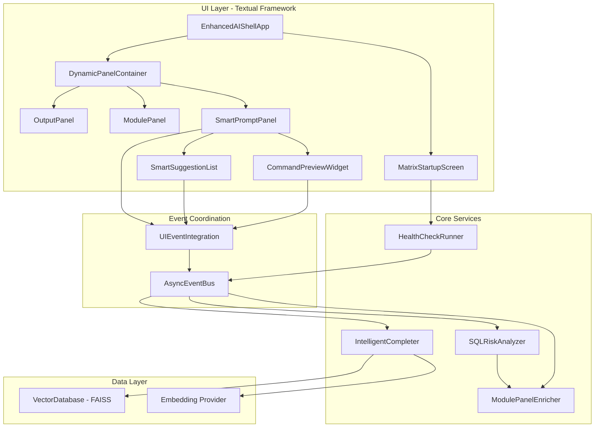
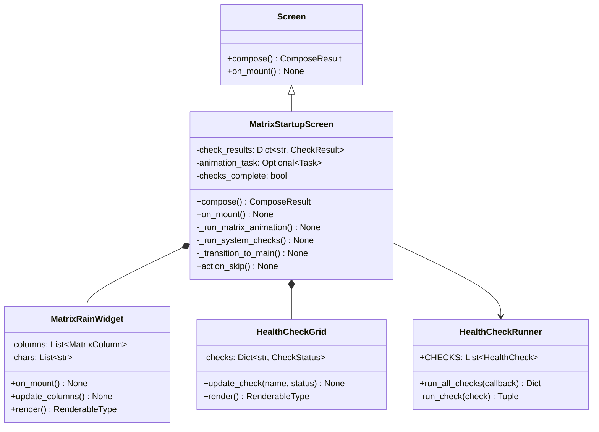
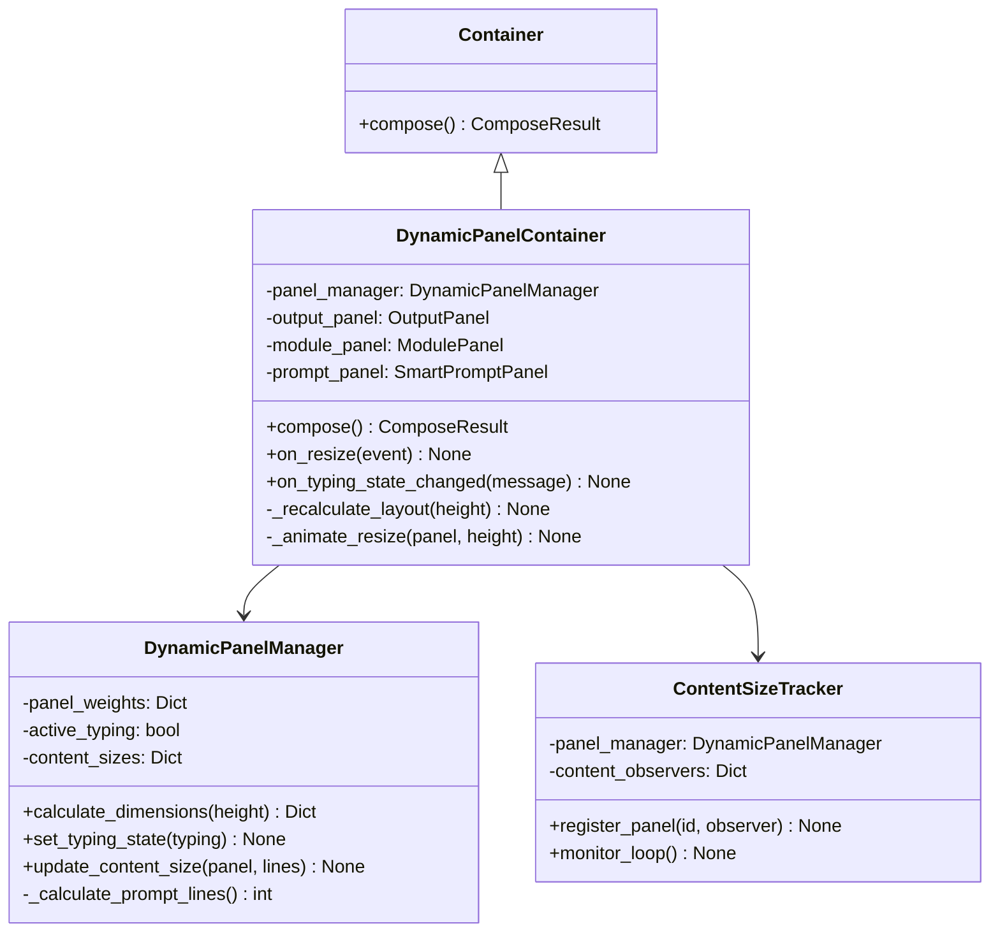
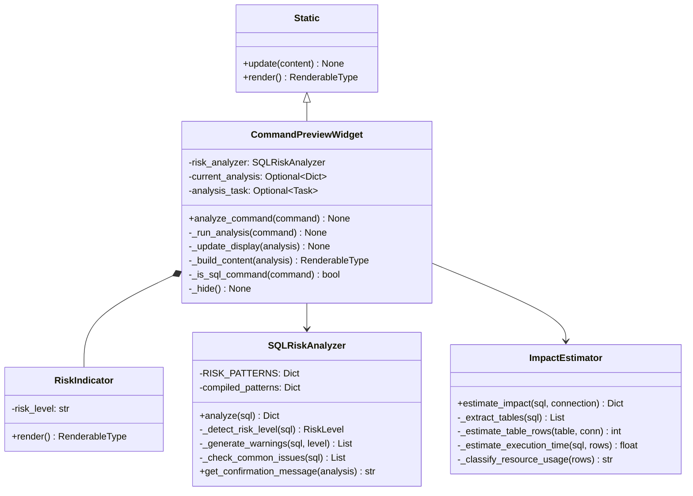
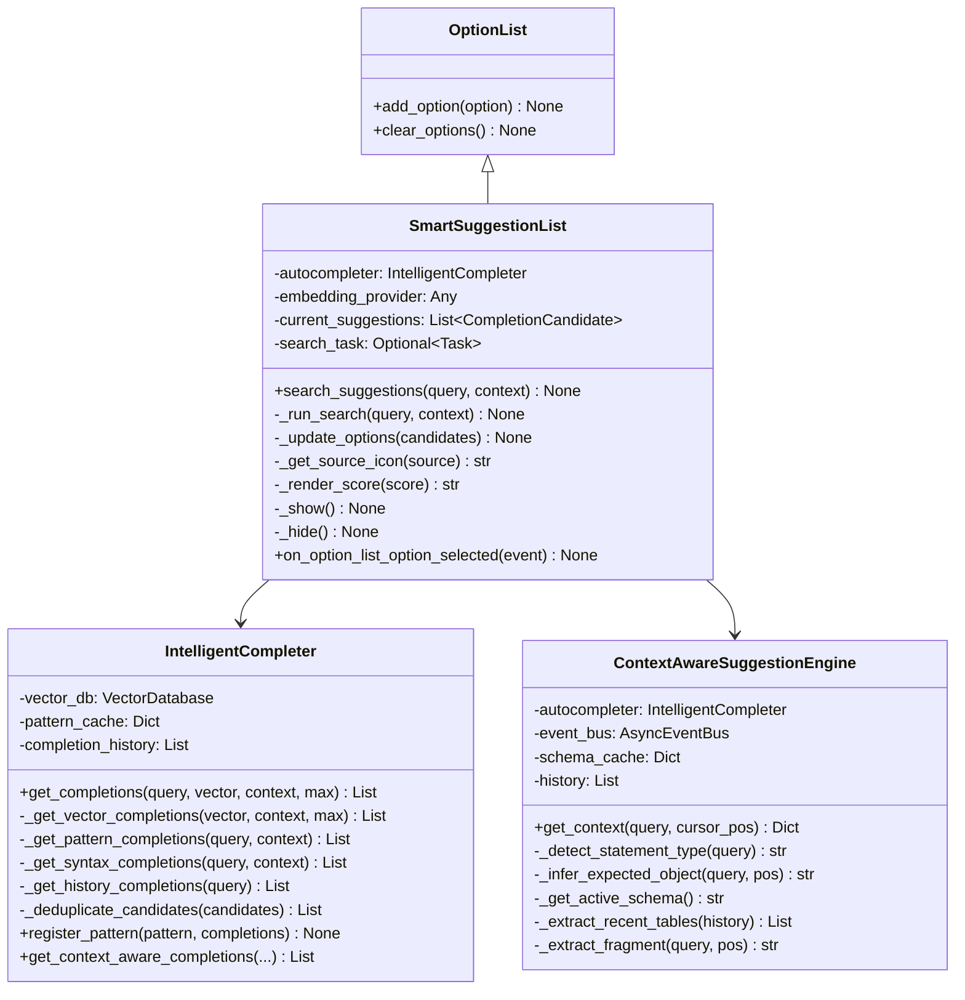
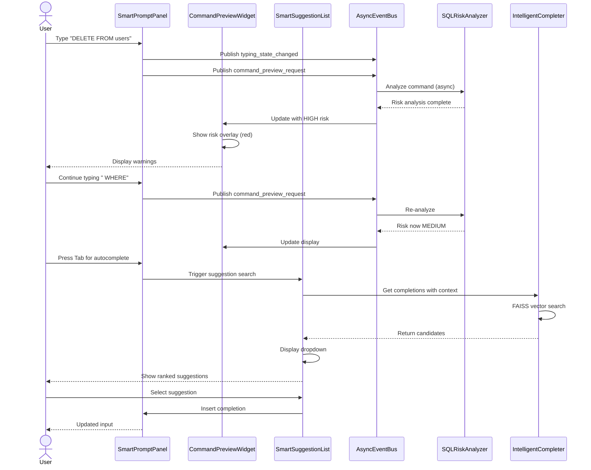
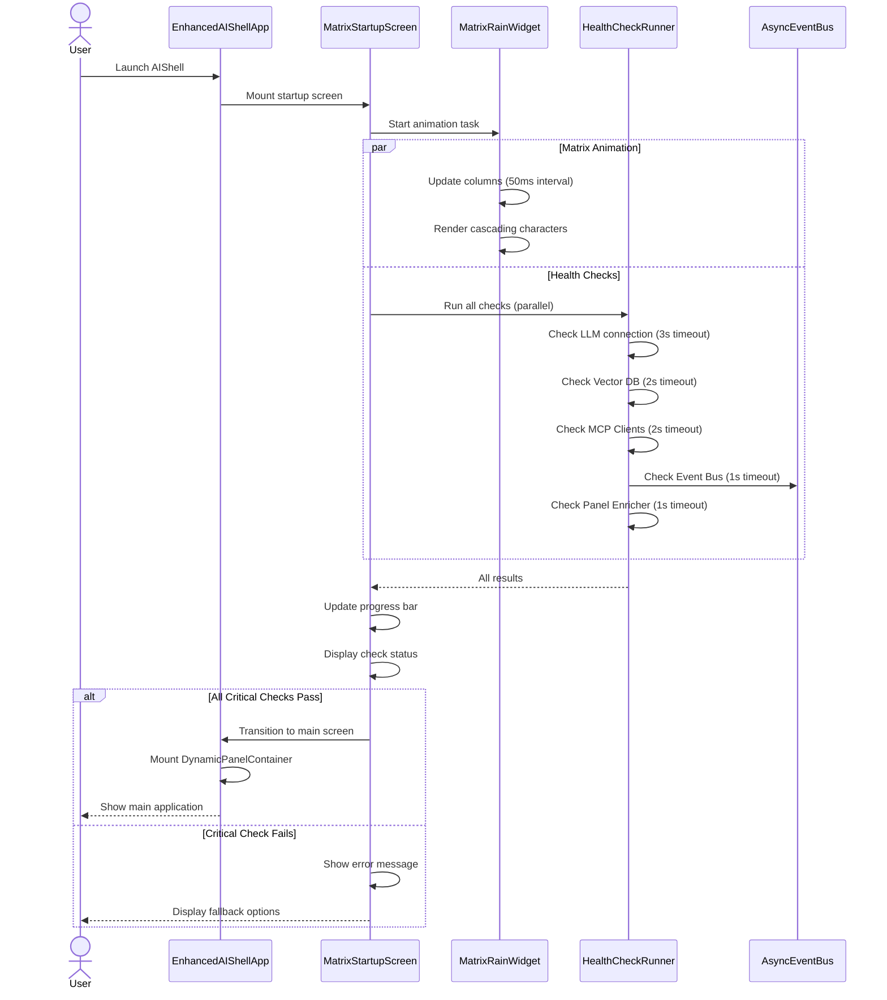
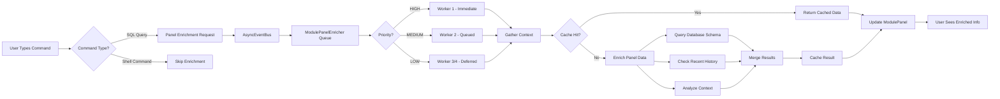
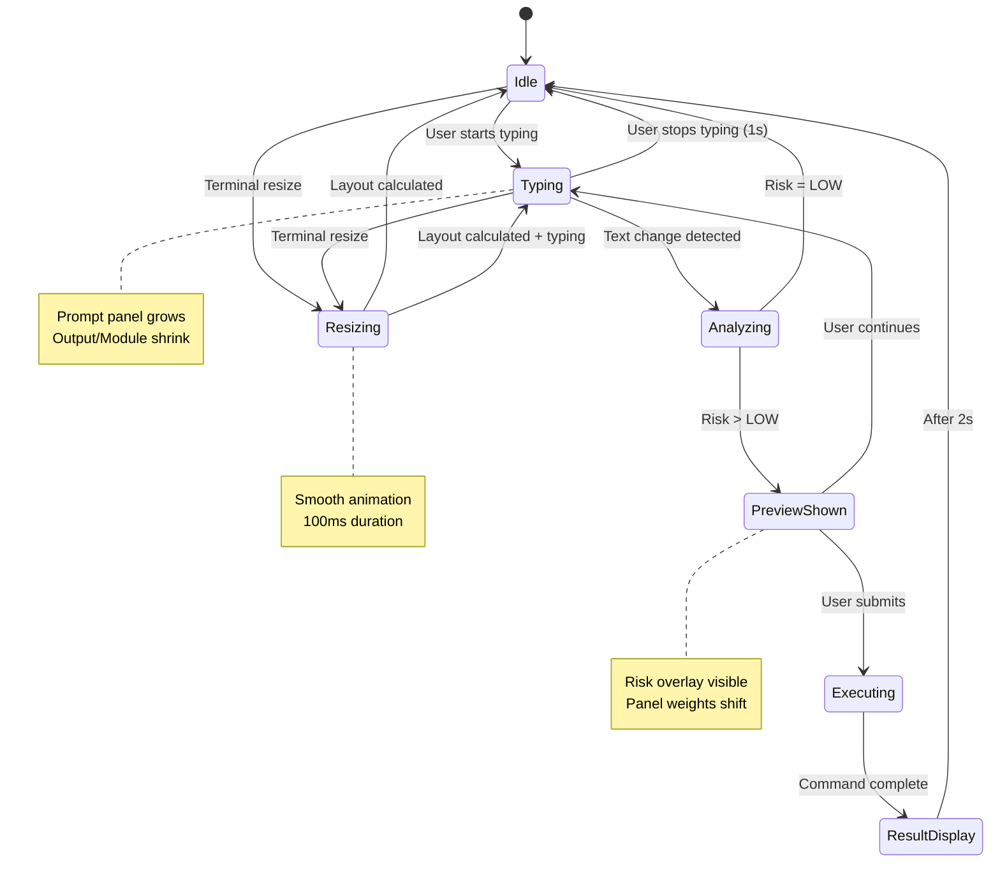

# Phase 11: Component Diagrams & Class Structures

## Component Interaction Diagram



## Class Hierarchy: MatrixStartupScreen



## Class Hierarchy: DynamicPanelContainer



## Class Hierarchy: Command Preview System



## Class Hierarchy: Smart Suggestion System



## Sequence Diagram: Command Input Flow



## Sequence Diagram: Startup Animation



## Data Flow: Panel Enrichment



## State Diagram: Panel Manager States



## Architecture Layers

```
┌─────────────────────────────────────────────────────────┐
│                    PRESENTATION LAYER                   │
│  ┌──────────────┐  ┌──────────────┐  ┌──────────────┐  │
│  │   Textual    │  │   Textual    │  │   Textual    │  │
│  │   Screens    │  │  Containers  │  │   Widgets    │  │
│  └──────────────┘  └──────────────┘  └──────────────┘  │
│         │                  │                  │         │
└─────────┼──────────────────┼──────────────────┼─────────┘
          │                  │                  │
┌─────────┼──────────────────┼──────────────────┼─────────┐
│         ↓                  ↓                  ↓         │
│                  INTEGRATION LAYER                      │
│  ┌──────────────────────────────────────────────────┐   │
│  │          UIEventIntegration Coordinator          │   │
│  └──────────────────────────────────────────────────┘   │
│                           ↕                             │
│  ┌──────────────────────────────────────────────────┐   │
│  │        AsyncEventBus (Priority Queue)            │   │
│  └──────────────────────────────────────────────────┘   │
└─────────────────────────────────────────────────────────┘
                            ↕
┌─────────────────────────────────────────────────────────┐
│                    SERVICE LAYER                        │
│  ┌──────────────┐  ┌──────────────┐  ┌──────────────┐  │
│  │ Risk         │  │ Autocomplete │  │ Panel        │  │
│  │ Analyzer     │  │ Engine       │  │ Enricher     │  │
│  └──────────────┘  └──────────────┘  └──────────────┘  │
│         │                  │                  │         │
└─────────┼──────────────────┼──────────────────┼─────────┘
          │                  │                  │
┌─────────┼──────────────────┼──────────────────┼─────────┐
│         ↓                  ↓                  ↓         │
│                     DATA LAYER                          │
│  ┌──────────────┐  ┌──────────────┐  ┌──────────────┐  │
│  │   FAISS      │  │  Embedding   │  │   Cache      │  │
│  │  VectorDB    │  │  Provider    │  │  Manager     │  │
│  └──────────────┘  └──────────────┘  └──────────────┘  │
└─────────────────────────────────────────────────────────┘
```

## Deployment View

```
┌─────────────────────────────────────────────────────────┐
│                   User's Terminal                       │
│  ┌──────────────────────────────────────────────────┐   │
│  │         Enhanced AIShell Process                 │   │
│  │  ┌────────────────────────────────────────────┐  │   │
│  │  │  Main Thread (Event Loop)                  │  │   │
│  │  │  - Textual UI rendering                    │  │   │
│  │  │  - Event bus processing                    │  │   │
│  │  │  - Panel updates                           │  │   │
│  │  └────────────────────────────────────────────┘  │   │
│  │                                                  │   │
│  │  ┌────────────────────────────────────────────┐  │   │
│  │  │  Worker Thread Pool (4 workers)            │  │   │
│  │  │  - Risk analysis                           │  │   │
│  │  │  - Vector search                           │  │   │
│  │  │  - Panel enrichment                        │  │   │
│  │  │  - Embedding generation                    │  │   │
│  │  └────────────────────────────────────────────┘  │   │
│  │                                                  │   │
│  │  ┌────────────────────────────────────────────┐  │   │
│  │  │  Memory-Mapped Storage                     │  │   │
│  │  │  - FAISS index (memory-mapped)             │  │   │
│  │  │  - Embedding cache                         │  │   │
│  │  │  - Enrichment cache                        │  │   │
│  │  └────────────────────────────────────────────┘  │   │
│  └──────────────────────────────────────────────────┘   │
└─────────────────────────────────────────────────────────┘
                          │
                          ↓
┌─────────────────────────────────────────────────────────┐
│                External Dependencies                    │
│  ┌──────────────┐  ┌──────────────┐  ┌──────────────┐  │
│  │   Ollama     │  │  Database    │  │   MCP        │  │
│  │   (LLM)      │  │  Servers     │  │  Clients     │  │
│  └──────────────┘  └──────────────┘  └──────────────┘  │
└─────────────────────────────────────────────────────────┘
```

## Performance Optimization Points

```
┌─────────────────────────────────────────────────────────┐
│              Optimization Strategy                      │
├─────────────────────────────────────────────────────────┤
│                                                         │
│  1. DEBOUNCING                                          │
│     • Typing input: 300ms before risk analysis          │
│     • Autocomplete: 150ms before vector search          │
│     • Panel resize: Immediate but animated              │
│                                                         │
│  2. CACHING                                             │
│     • Panel enrichment: 60% cache hit rate              │
│     • Autocomplete history: Last 100 items              │
│     • Schema metadata: 5-minute TTL                     │
│                                                         │
│  3. ASYNC THREADING                                     │
│     • All CPU-intensive work in thread pool             │
│     • FAISS searches: asyncio.to_thread()               │
│     • Risk analysis: asyncio.to_thread()                │
│                                                         │
│  4. PRIORITY QUEUING                                    │
│     • CRITICAL: Command execution events                │
│     • HIGH: Risk analysis, command preview              │
│     • NORMAL: Autocomplete, typing state                │
│     • LOW: Panel enrichment, background updates         │
│                                                         │
│  5. MEMORY MANAGEMENT                                   │
│     • Warning threshold: 150MB                          │
│     • Critical threshold: 200MB                         │
│     • Cleanup interval: Every 5 seconds                 │
│     • Gradual cache eviction on warning                 │
│                                                         │
└─────────────────────────────────────────────────────────┘
```

---

**Document Version:** 1.0
**Created:** 2025-10-04
**Purpose:** Visual reference for Phase 11 implementation
